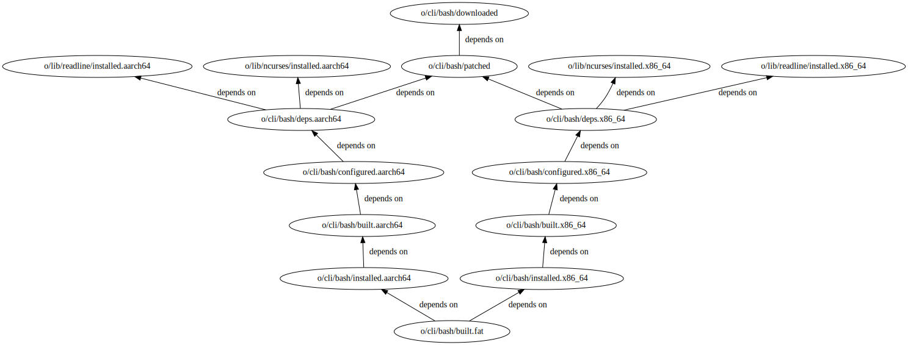

# How does `superconfigure` build software?

This document explains how the software packages in `superconfigure` are built,
by providing some surrounding context for `config/common.mk`,
`config/functions.mk` and all the `BUILD.mk` files in the repo.  

Our general goal is to have a wrapper around the autotools-style build scripts
for software, so that we can build software with Cosmopolitan Libc, without
changing too much of the source code.Let's look at how that works when
building `bash`. 

## building `bash`

To build `bash` with Cosmopolitan Libc, we need to go through the following steps:

1. Download `bash` source
2. verify checksum of the downloaded source
3. (possibly) Patch the source code to enable building with Cosmopolitan Libc
4. Confirm the dependencies for `bash` (`ncurses` and `readline`) have been
  installed
5. Configure, build, install for `x86_64`
6. Configure, build, install for `aarch64`
7. Use Cosmopolitan Libc's `apelink` to combine the `x86_64` and `aarch64` 
debug binaries to build a fat binary, and add necessary zip store assets.
8. now we should have a `bash` in `results/bin`

These steps need to occur in a specific order: 1, 2, 3, 4, (5, 6 can occur
simultaneously), and then 7. We enforce this order via Makefile dependencies.
Thus the build steps for `bash`, expressed graphically, would look like:



Thus to build bash from the root of the repo, we write `make
o/cli/bash/built.fat`.  Note that building `bash` requires `ncurses` and
`readline` to have already been installed, and this is also expressed as part of
the recipe: `o/cli/bash/deps.x86_64` needs `o/lib/ncurses/installed.x86_64` and
`o/lib/readline/installed.x86_64`, each of which require their own
`downloaded`/`patched`/`configured`/`built` steps. These steps are common to
every `BUILD.mk`, let's see how each of them work.

## General steps and defaults

From the image above, we note that building bash will have a recipe something
like with the following steps:

1. Download `bash` source

```Makefile
o/cli/bash/downloaded: DL_COMMAND = $(DL_DEFAULT)
o/cli/bash/downloaded: DL_FILE = 
```

`$(DL_DEFAULT)` calls a script wrapping `wget`, that downloads any `.tar.gz`,
`.tar.xz`, `.tar.bz2`, and `.zip` file. The command will fail if `$(DL_FILE)` is
not provided.

2. verify checksum of downloaded source

```Makefile
o/cli/bash/checked: cli/bash/check.signature
o/cli/bash/checked: o/cli/bash/downloaded
```

Before extracting the source files, we verify the SHA256 checksum of the
downloaded file with a `check.signature` stored alongside the `BUILD.mk` file.
**Note:** every `BUILD.mk` must have a `check.signature` in the same folder
(even if it is an empty file to start with) otherwise the Makefile won't work.
The source tarball is extracted only if the verification succeeds.


3. (possibly) Patch the source code to enable building with Cosmopolitan Libc

```Makefile
o/cli/bash/patched: o/cli/bash/checked
o/cli/bash/patched: PATCH_COMMAND = $(PATCH_DEFAULT)
o/cli/bash/patched: PATCH_FILE =
```

We ensure that patching happens only after the source has been downloaded.
`$(PATCH_DEFAULT)` calls a script wrapping `patch -p0 -i`, and `$(PATCH_FILE)`
is usually set to a `minimal.diff` file located next to a `BUILD.mk`. The
command will fail if `$(PATCH_FILE)` is not provided, but will exit without
error if the provided `$(PATCH_FILE)` doesn't exist.

4. Confirm the dependencies for `bash` (`ncurses` and `readline`) have been
  installed

```Makefile
o/cli/bash/deps.x86_64: o/cli/bash/patched o/lib/readline/installed.x86_64 o/lib/ncurses.installed.x86_64
o/cli/bash/deps.x86_64: DEPS_COMMAND = $(DEPS_DEFAULT)
```

`$(DEPS_DEFAULT)` is just an `echo ""`, this target usually is just to ensure
the dependencies have been installed correctly.

5. Configure, build, install for `x86_64`
6. Configure, build, install for `aarch64`

```Makefile
# similar for both x86_64 and aarch64
o/cli/bash/configured.aarch64: o/cli/bash/deps.aarch64
o/cli/bash/configured.aarch64: CONFIG_COMMAND = $(CONFIG_DEFAULT)
o/cli/bash/built.x86_64: o/cli/bash/configured.x86_64
o/cli/bash/built.x86_64: BUILD_COMMAND = $(BUILD_DEFAULT)
o/cli/bash/installed.aarch64: o/cli/bash/built.aarch64
o/cli/bash/installed.aarch64: INSTALL_COMMAND = $(INSTALL_DEFAULT)
```

`$(CONFIG_DEFAULT)` is a script that errors out -- every `BUILD.mk` must
override `CONFIG_COMMAND` one way or another.

`$(BUILD_DEFAULT)` is just `make -j$(MAXPROC)`.

`$(INSTALL_DEFAULT)` is just `make install -j$(MAXPROC)`.

7. Use Cosmopolitan Libc's `apelink` to combine the `x86_64` and `aarch64` 
debug binaries to build a fat binary, and add necessary zip store assets.

```Makefile
o/cli/bash/built.fat: FATTEN_COMMAND = $(APELINKPLS)
o/cli/bash/built.fat: BINS =
o/cli/bash/built.fat: o/cli/bash/installed.x86_64 o/cli/bash/installed.aarch64
```

`$(APELINKPLS)` is a script that wraps Cosmopolitan Libc's `apelink` binary, and
for each file `$EXE` in `BINS`, it creates a fat binary from
    `$COSMOS/x86_64/bin/$EXE` and `$COSMOS/aarch64/bin/$EXE`.

## Conveniences

For convenience, we have some functions implemented in `config/functions.mk` to
simplify writing some of the above steps. These are basically some form of text
substitution, and we invoke them as:

```Makefile
$(eval $(call FUNC_NAME,param1,param2))
```

We have 4 functions for now: `DOWNLOAD_SOURCE`, `SPECIFY_DEPS`,
`AUTOTOOLS_BUILD`, `CMAKE_BUILD`. These help out when the recipe has a lot of
dependencies.

Instead of writing:

```Makefile
o/cli/bash/downloaded: DL_FILE = https://ftp.gnu.org/gnu/bash/bash-5.2.tar.gz
o/cli/bash/patched: PATCH_FILE = $(BASELOC)/cli/bash/minimal.diff
```

We can write:

```Makefile
BASH_SRC := https://ftp.gnu.org/gnu/bash/bash-5.2.tar.gz 
$(eval $(call DOWNLOAD_SOURCE,cli/bash,$(BASH_SRC)))
```

Instead of writing:

```Makefile
o/cli/bash/deps.x86_64: o/lib/ncurses/installed.x86_64 o/lib/readline/installed.x86_64
o/cli/bash/deps.aarch64: o/lib/ncurses/installed.aarch64 o/lib/readline/installed.aarch64
```

We can write:

```Makefile
BASH_DEPS := lib/ncurses lib/readline
$(eval $(call SPECIFY_DEPS,cli/bash,$(BASH_DEPS)))
```

Instead of writing:

```Makefile
BASH_CONFIG_ARGS = --disable-static --prefix=$(COSMOS)
o/cli/bash/configured.x86_64: CONFIG_COMMAND = ../../bash*/configure $(BASH_CONFIG_ARGS)
o/cli/bash/configured.aarch64: CONFIG_COMMAND = ../../bash*/configure $(BASH_CONFIG_ARGS)
```

We can write:

```Makefile
# note the $$
BASH_CONFIG_ARGS = --disable-static --prefix=$$(COSMOS)
$(eval $(call DOWNLOAD_SOURCE,cli/bash,$(BASH_CONFIG_ARGS),$(BASH_CONFIG_ARGS)))
```

## How much can be customized?

Each step allows us to run a shell script
(`DL_COMMAND`/`PATCH_COMMAND`/`CONFIG_COMMAND`/`BUILD_COMMAND`/`INSTALL_COMMAND`/`FATTEN_COMMAND`)
so we could set any these variables to some custom shell scripts when writing
the `BUILD.mk`. We could also define new targets between the ones we have in
case there is some custom build behavior. 

Important things to remember:

- Shell scripts for download/patch won't have access to any environment
  variables like `$COSMOS` (maybe they should).
- Shell scripts for configure/build/install will have access to environment
  variables in `config/vars-x86_64` or `config/vars-aarch64`
- the `FATTEN_COMMAND` shell script will have access to environment variables in
  `config/vars-fat`.
- Override the `_COMMAND` variables, don't override the `_DEFAULT` variables!
- avoid putting overly long commands inside a Makefile, write it in a shell
  script instead.

Here are some examples:

- `cli/berry/BUILD.mk` clones from a git repo, so we can change the `DL_COMMAND`
  for the `o/cli/berry/downloaded` target to do a `git clone` instead of `wget`.
- `cli/berry/BUILD.mk` also has a slightly different patch, so we can change the
  `PATCH_COMMAND` to be `patch -p1 -i` and `PATCH_FILE` to be the usual file.
- `lib/pcre` and `lib/libyaml` need to run `autoconf` or something on the
  source, so we define a `o/lib/pcre/setup` target that runs before the
  configure and handle that there.
- `web/git/BUILD.mk` does the entire build+install via `CONFIG_COMMAND =
  $(BASELOC)/web/git/config-wrapper`, because the git build requires the `LIBS`
  environment variable to be set properly. Note the `BUILD_COMMAND` and
  `INSTALL_COMMAND` variables are set to `$(DUMMYLINK0)`.
- The `BUILD_COMMAND` and `INSTALL_COMMAND` variables being set to
  `$(DUMMYLINK0)` is quite common.
- `editor/emacs`, `compiler/x86_64-gcc`, and `web/git` set `FATTEN_COMMAND` to
  their custom `fatten` script.
- `FATTEN_COMMAND` being set to `$(DUMMYLINK0)` is also common for the entries
  in `lib`.
- `lib/certs/BUILD.mk` is not a software build at all -- almost everything is a
  `$(DUMMYLINK0)` and the only thing that happens is that SSL certs are copied
  into the right spot in `/zip`.

## TODOs and TBDs

- Can we avoid relative paths everywhere, and use `$(BASELOC)/absolute/path`
  wherever needed?
- What to do about environment variables? How do we control total number of
  processes?
- What other Makefile functions will be useful? Can the functions be better?
- Switching between makefile vs shell gets a bit confiusing. How much should be
  inside a Makefile, and how much should be inside a shell script?
- How easy is it to add Cosmopolitan Libc's `zipobj` to ncurses/openssl
  builds and reduce customization in `FATTEN_COMMAND`?
- How easy is it to add Cosmopolitan Libc's `pledge` to each build?
- Can we write a tool to generate these `BUILD.mk` files for more packages? (a
  cookiecutter template type of thing)
